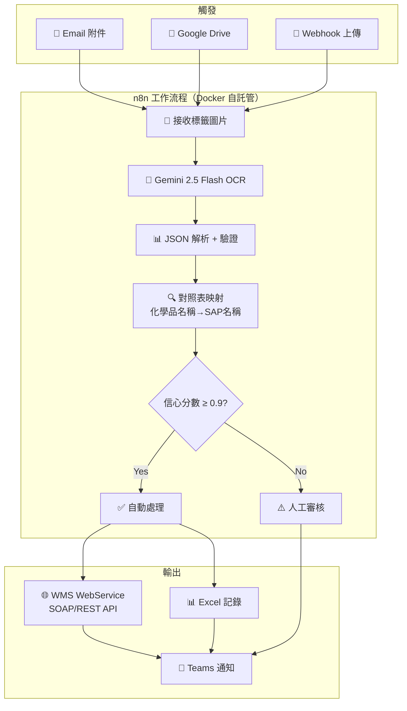

# 📦 來料標籤 OCR → WMS 自動化 — 最終實施計畫

> 基於用戶確認的需求重新整合（2026-02-15）

---

## 📋 需求確認摘要

| 項目 | 確認內容 |
|------|----------|
| **供應商數量** | 8 家：永寬、上慶、南亞pet、南亞RF、新綜、上豪、玻力特、立大 |
| **標籤欄位** | SERIAL_NO, VENDOR, MATERIAL_NO, MTL_LOT_NO, IS_BONDED, METER, UNIT, INDICATOR, CLAIM_MEMO, MANUFACTURE_DATE, EXPIRATION_DATE |
| **對照表** | 化學品名稱 ↔ SAP 名稱映射（108 筆） |
| **WMS 系統** | 自行開發，透過 **WebService** 串接外部系統 |
| **Docker** | ❌ 未就緒，需協助建立 |
| **Gemini API Key** | ❌ 尚未取得 |
| **優先順序** | 先處理來料標籤 |


---

## 🏗️ 整體架構



---

## 📅 分階段實施計畫

### Phase 0：環境建置（本次優先）

#### Step 0-1：安裝 Docker Desktop

```powershell
# 1. 下載 Docker Desktop for Windows
# https://desktop.docker.com/win/main/amd64/Docker%20Desktop%20Installer.exe

# 2. 安裝後啟用 WSL 2（如果尚未啟用）
wsl --install

# 3. 重啟電腦後，開啟 Docker Desktop
# 4. 確認安裝成功
docker --version
docker compose version
```

#### Step 0-2：取得 Gemini API Key

1. 前往 [Google AI Studio](https://aistudio.google.com/apikey)
2. 登入 Google 帳號
3. 點擊 **Create API Key** → **Create API key in new project**
4. 複製 API Key（格式：`AIzaSy...`，約 40 字元）
5. 安全儲存（環境變數或密碼管理器）

> [!CAUTION]
> API Key 不要上傳到 GitHub 或寫在程式碼中！

#### Step 0-3：部署 n8n

在專案目錄建立 `docker-compose.yml` 並啟動：

```yaml
version: '3.8'
services:
  n8n:
    image: docker.n8n.io/n8nio/n8n
    restart: always
    ports:
      - "5678:5678"
    volumes:
      - n8n_data:/home/node/.n8n
    environment:
      - N8N_BASIC_AUTH_ACTIVE=true
      - N8N_BASIC_AUTH_USER=admin
      - N8N_BASIC_AUTH_PASSWORD=PackListWMS2026
      - GENERIC_TIMEZONE=Asia/Taipei
      - TZ=Asia/Taipei
      - GEMINI_API_KEY=${GEMINI_API_KEY}

volumes:
  n8n_data:
```

```powershell
# 啟動 n8n
docker compose up -d

# 訪問 http://localhost:5678
```

---

### Phase 1：n8n Workflow 建立

#### 7 個節點配置

| # | 節點名稱 | 類型 | 功能 |
|---|---------|------|------|
| 1 | 接收標籤 | Webhook | POST `/incoming-label`，接收圖片 |
| 2 | 圖片預處理 | Code | 調整尺寸/銳化（選配） |
| 3 | Gemini OCR | HTTP Request | Gemini 2.5 Flash Vision API |
| 4 | JSON 解析 | Code | 解析 + 電話/日期驗證 |
| 5 | 品質檢查 | IF | confidence ≥ 0.9 分流 |
| 6 | 資料輸出 | Excel/HTTP | Excel 寫入 + WMS WebService 呼叫 |
| 7 | 通知 | Teams/Email | 成功/審核通知 |

#### Gemini Prompt 核心設計

需支援 8 家供應商的不同標籤格式，統一輸出至標準欄位：

```
SERIAL_NO | VENDOR | MATERIAL_NO | MTL_LOT_NO | IS_BONDED
METER | UNIT | INDICATOR | CLAIM_MEMO
MANUFACTURE_DATE | EXPIRATION_DATE
```

---

### Phase 2：WMS WebService 整合

> [!IMPORTANT]
> 需要用戶提供 WMS WebService 的 **WSDL 位址**或 **API 文件**

n8n 的 HTTP Request 節點支援 SOAP/REST：

- **SOAP**：使用 XML Body + SOAPAction Header
- **REST**：使用 JSON Body + Bearer Token

---

### Phase 3：測試與上線

| 週次 | 目標 | 驗證標準 |
|------|------|----------|
| 第 1 週 | PoC：每家供應商各測 5 張 | 基本欄位提取正確 |
| 第 2 週 | 優化 Prompt，測 100 張 | 準確率 ≥ 95% |
| 第 3 週 | 接入 WMS WebService | 資料正確入庫 |
| 第 4 週 | 全量上線 | 穩定運行 |

---

## 💰 成本

| 項目 | 費用 |
|------|------|
| n8n 自託管 | **免費** |
| Docker Desktop | **免費**（個人/小型團隊） |
| Gemini API（1K 張/月） | **~NT$12** |
| Gemini API（10K 張/月） | **~NT$72** |

---

## ⚠️ 仍需用戶提供

1. **WMS WebService 文件**：WSDL 位址 / API Endpoint / 認證方式
2. **各家供應商的實際標籤照片樣本**（用於 Prompt 優化與測試）
3. **對照表完整資料**（化學品名稱 → SAP 名稱映射）
